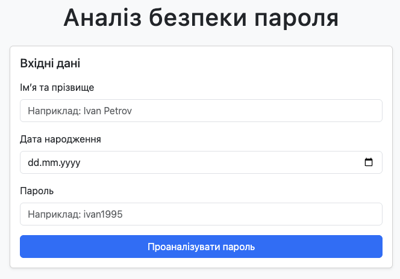
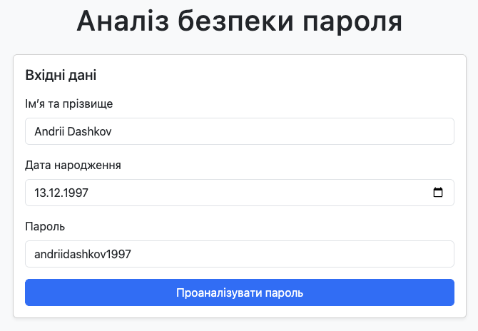
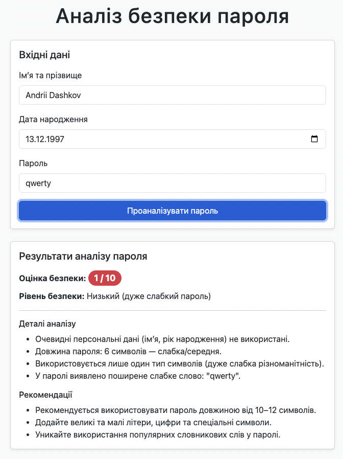
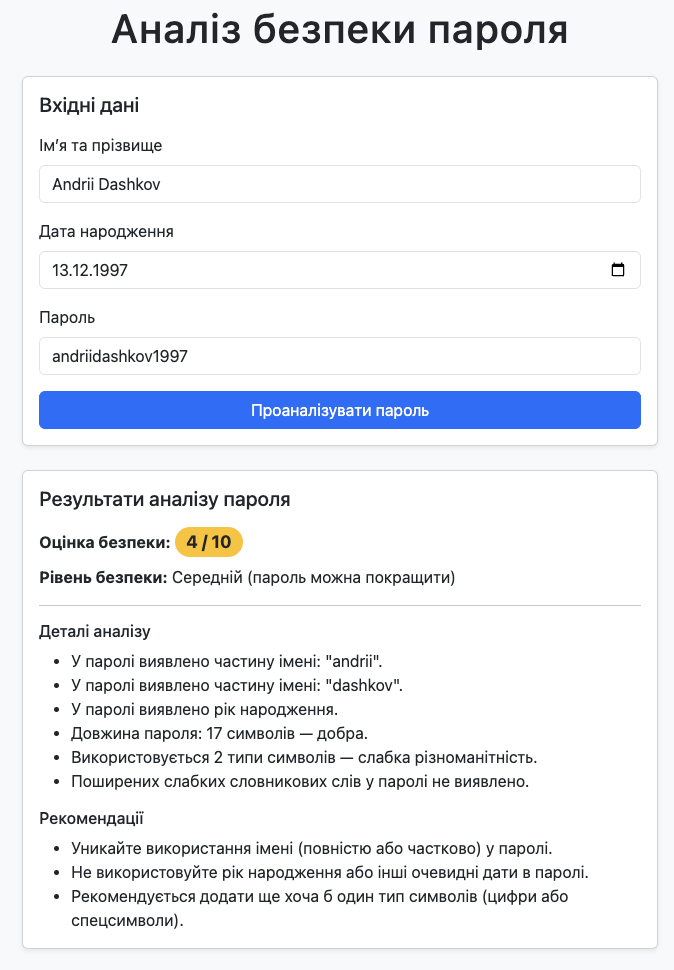
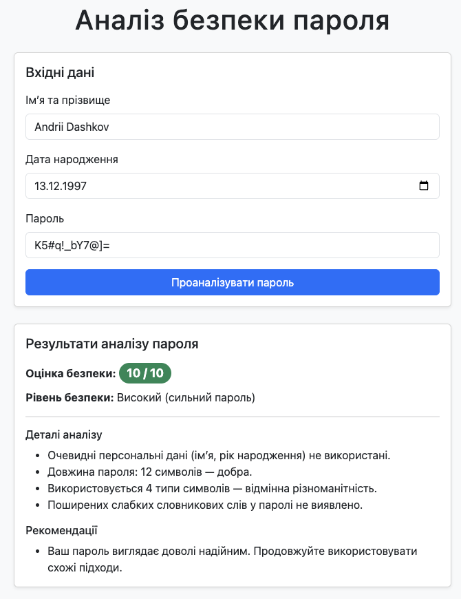

# Лабораторна робота № 1. Аудит власної цифрової безпеки

Для того, щоб запустити програму на виконання, достатньо відкрити файл **index.html** в будь-якому браузері.

## Приклади роботи програми

Програма має наступний початковий вигляд:

Далі потрібно ввести відповідні дані в усі необхідні поля та натиснути кнопку "Проаналізувати пароль". 

Після цього програма видасть результат аналізу пароля з оцінкою за десятибальною шкалою, деталями аналізу та рекомендаціями щодо покращення надійності пароля:

Наступні результати аналізу ми отримуємо для пароля надійності нижче середнього:

Далі - результати аналізу надійного пароля:

