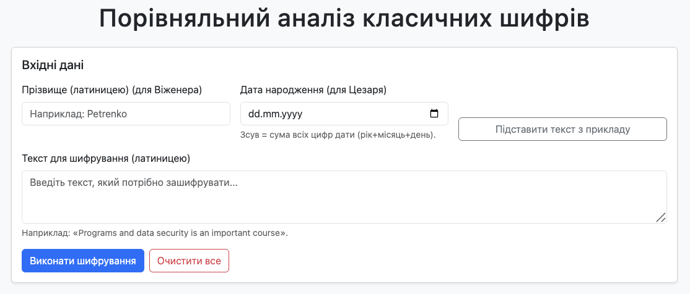
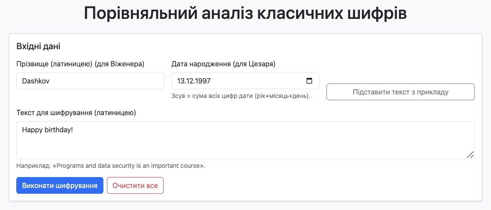
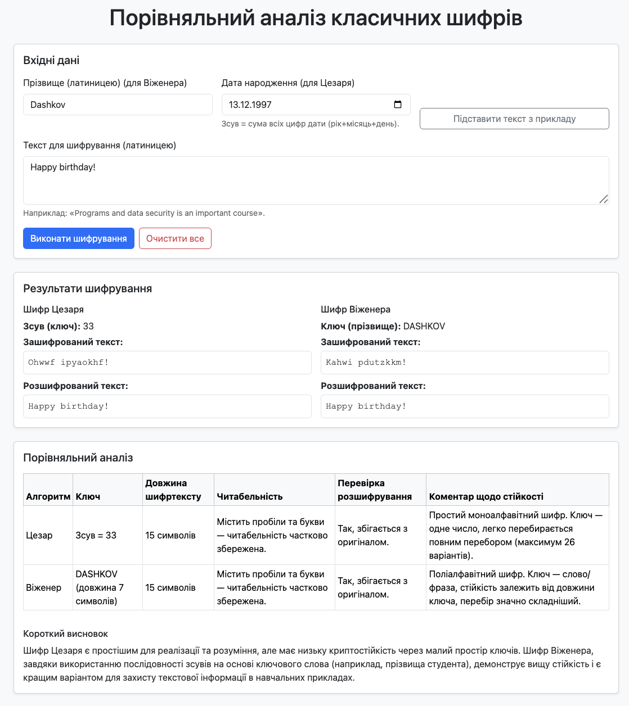

# Лабораторна робота № 2. Захист особистих повідомлень

Для того, щоб запустити програму на виконання, достатньо відкрити файл **index.html** в будь-якому браузері.

## Приклади роботи програми

Програма має наступний початковий вигляд:

Вводимо відповідні дані у всі необхідні поля та натискаємо кнопку "Виконати шифрування".

Пісдя цього програма видає результат шифрування та розшифрування заданого тексту двома алгоритмами - Цезаря та Віженера - та порівняння цих алгоритмів.

Як бачимо, заданий текст був зашифрований та розшифрований обома алгоритмами правильно, тобто зрештою ми отримали оригінальний текст без викривлень. Також бачимо короткі висновки щодо порівняння двох алгоритмів.

Цікавою наочною відмінністю цих двох алгоритмів є те, що, незважаючи на те, що довжина зашифрованого тексту однакова, є деякі відмінності в тому, як алгоритм вираховує повторювані символи: до прикладу, у слові "Happy" повторюван символи "p" ("pp") в алгоритмі Цезаря перетворюються також у повторювані символи "w" ("ww"), а в алгоритмі Віженера вони перетворюються у різні символи - "hw", що ускладнює злам даного алгоритму.