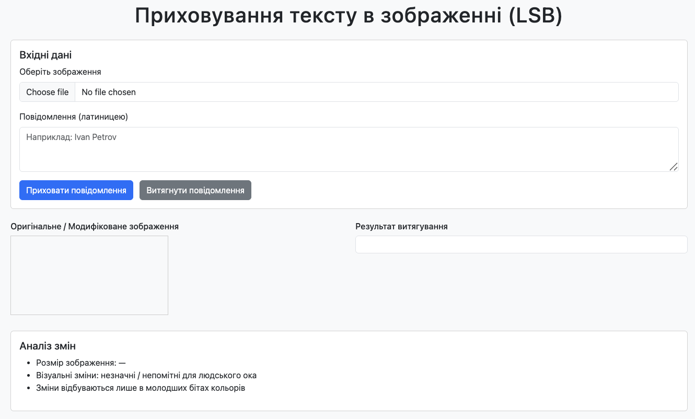
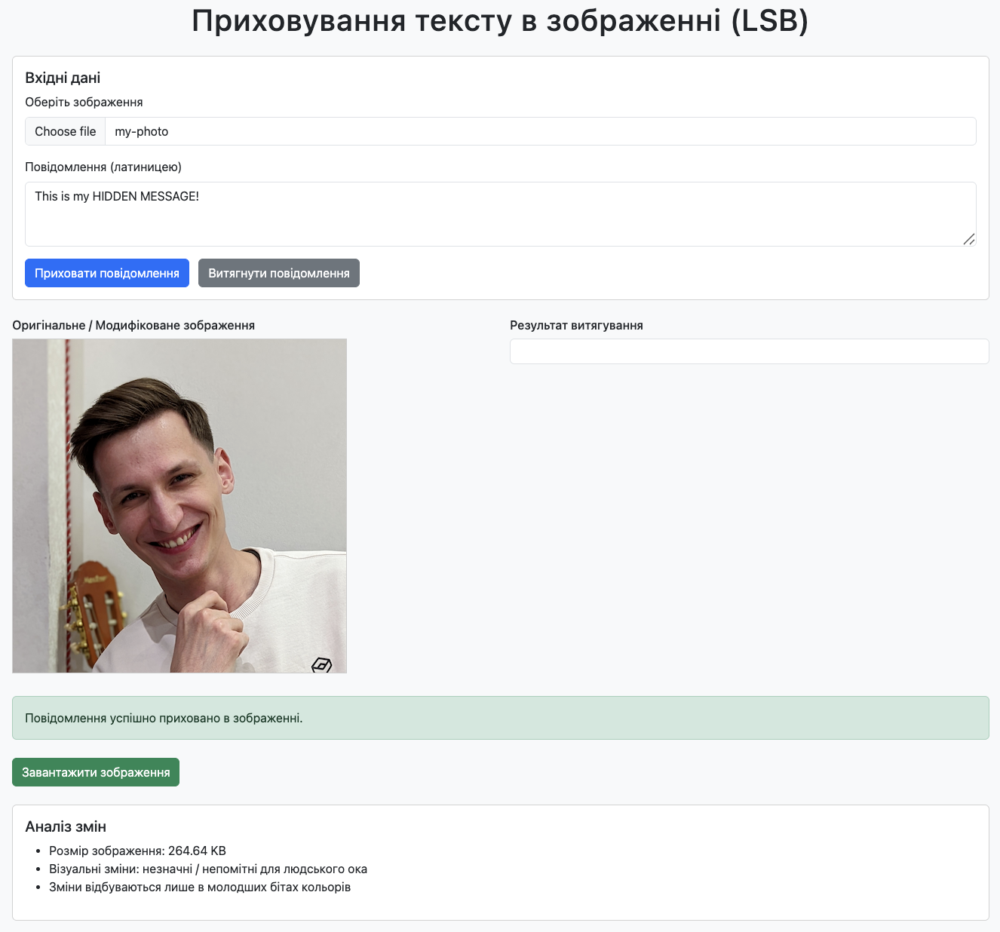
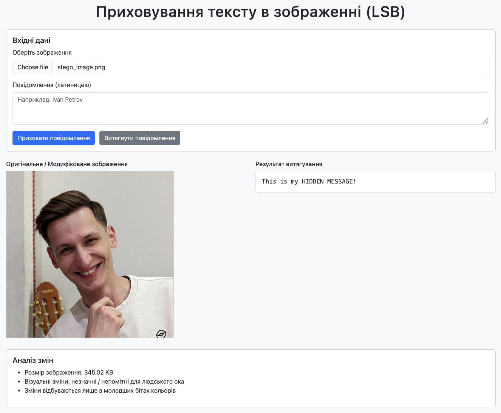

# Лабораторна робота № 3. Невидимі дані у власних файлах

Для того, щоб запустити програму на виконання, достатньо відкрити файл **index.html** в будь-якому браузері.

## Приклади роботи програми

Програма має наступний початковий вигляд:

Обираємо зображення, в якому хочемо приховати текст, та вводимо сам текст. Після цього натискаємо кнопку "Приховати повідомлення".

Тепер можемо натиснути кнопку "Завантажити зображення", щоб скачати зображення з прихованим текстом.

Далі, для чистоти експерименту, можна перезавантажити сторінку, і цього разу обрати зображення з прихованим текстом, яке ми скачали на попередньому етапі (stego_image.png). Текст вводити не потрібно - ми просто натискаємо кнопку "Витягнути повідомлення" і бачимо як програма дістала наш зашифрований текст із зображення.

Як бачимо, людському оку абсолютно не помітно, що в зображенні є якийсь прихований текст. Це завдяки тому, що ми змінюємо молодші біти RGB-каналів пікселів, бо їх зміна мінімально впливає на колір пікселя, що дозволяє приховувати інформацію без помітних візуальних змін зображення. Кожен символ тексту перетворюється у двійковий формат відповідно до ASCII-коду, і потім отримана бітова послідовність по черзі записується в молодші біти RGB-каналів пікселів.