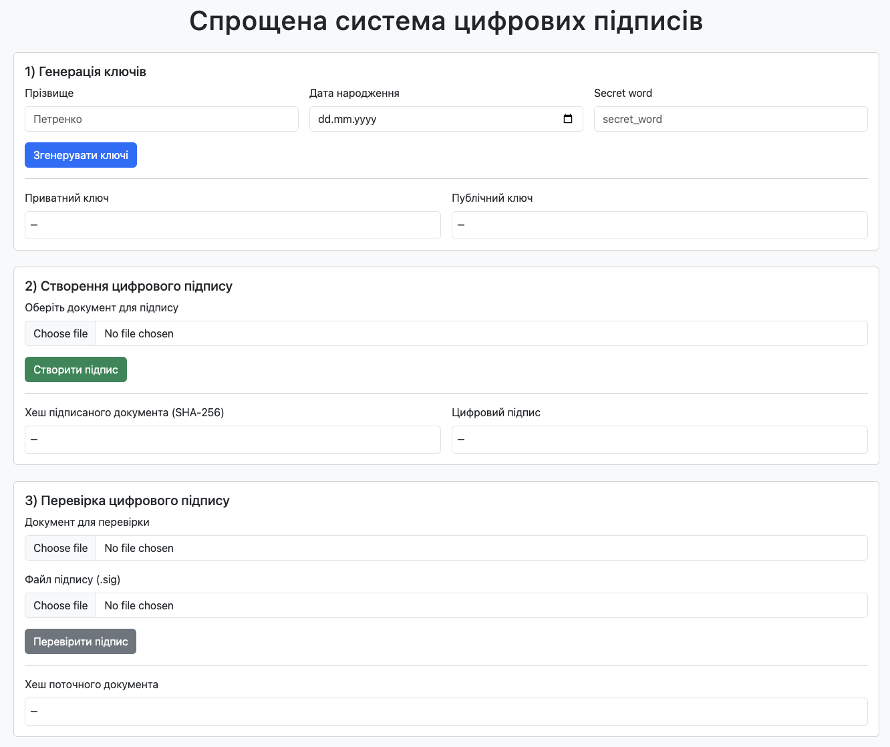
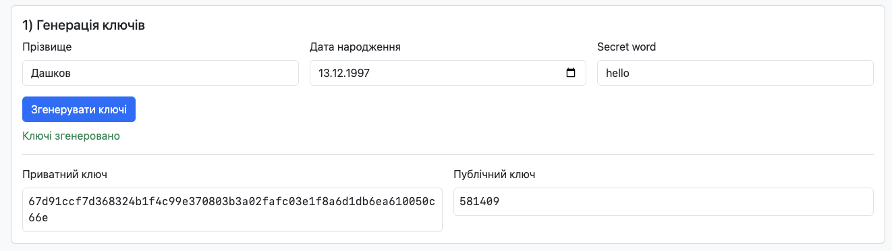
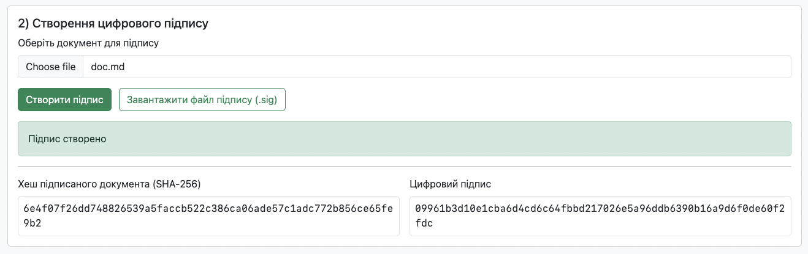
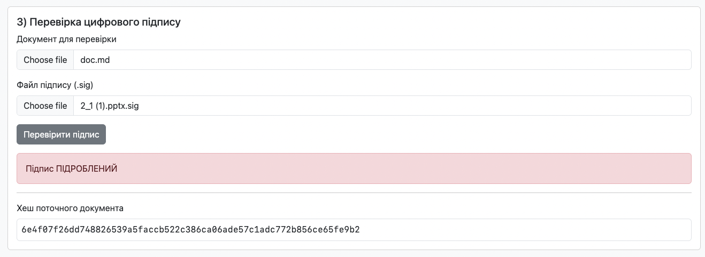

# Лабораторна робота № 4. Особистий цифровий підпис

Для того, щоб запустити програму на виконання, достатньо відкрити файл **index.html** в будь-якому браузері.

## Приклади роботи програми

Програма має наступний початковий вигляд:

У секції "1) Генерація ключів" вводимо необхідні персональні дані та натискаємо на кнопку "Згенерувати ключі", після чого програма згенерує приватний та публічний ключі і виведе їх на екрані для наочності. Ці ключі програма буде використовувати надалі для генерації цифрового підпису та перевірки цифрового підпису.

Далі, для створення цифрового підпису документа ми переходимо до секції "2) Створення цифрового підпису". Тут ми обираємо документ, для якого ми хочемо створити цифровий підпис, та натискаємо на кнопку "Створити підпис". Після цього програма згенерує цифровий підпис, виведе його на екран для наочності, а також зʼявиться кнопка "Завантажити файл підпису", яка дозволяє зберігти файл цифрового підпису для використання в майбутньому - натиснемо на неї та збережемо файл цифрового підпису.

Тепер перевіримо дійсність цифрового підпису для документа. Обираємо документ та файл цифрового підпису, після цього натискаємо на кнопку "Перевірити підпис". Система перевірить дійсність цифрового ключа за допомогою публічного ключа та хеша документа і виведе результат перевірки на екран.

Якщо ж ми візьмемо недійсний цифровий підпис, або цифровий підпис для іншого документа, то програма виведе повідомлення про невалідність цифрового підпису.

