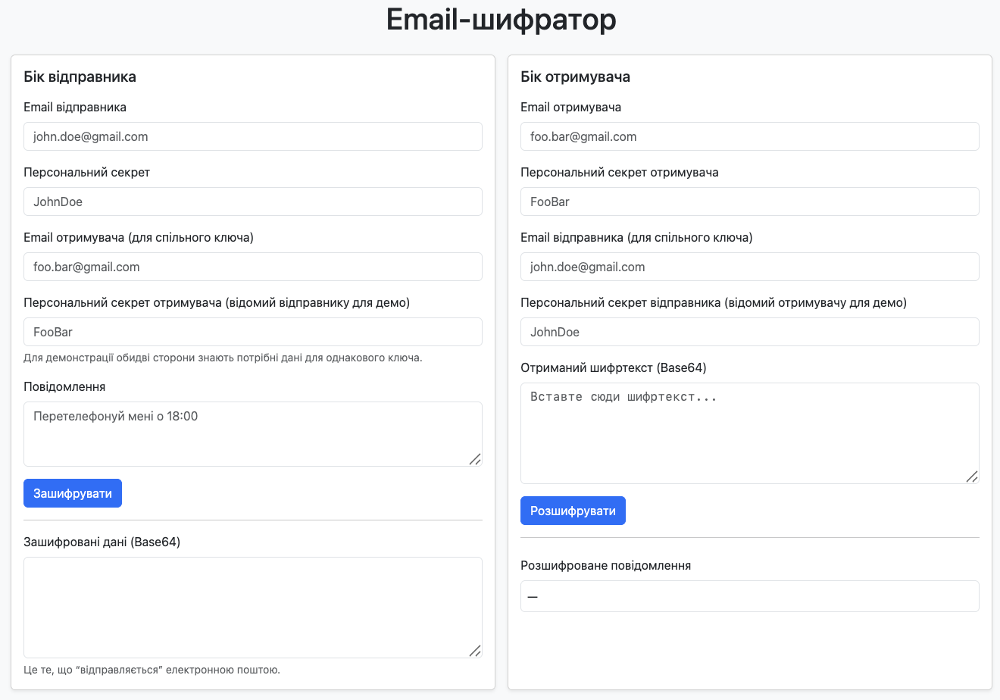
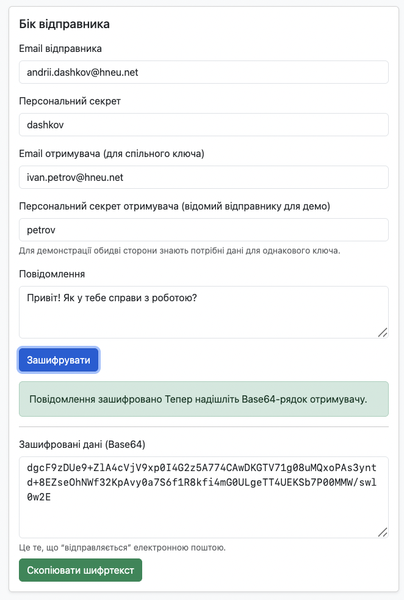
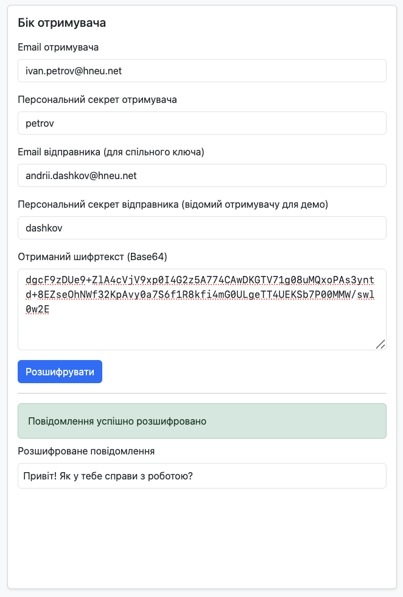
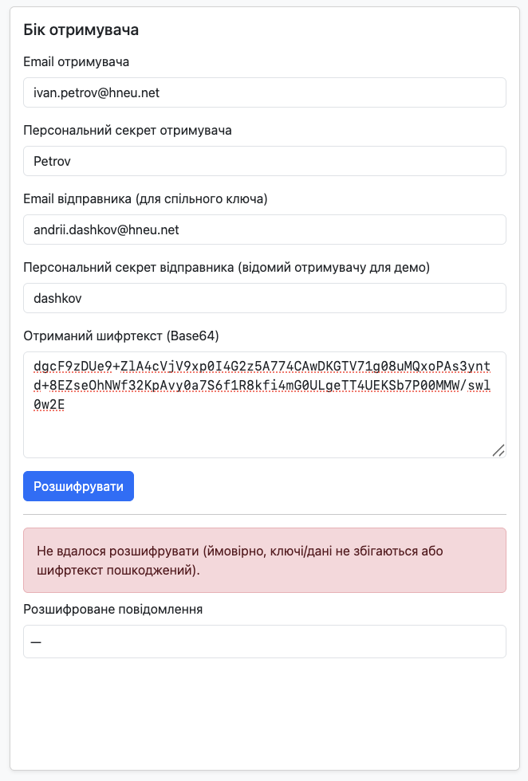

# Лабораторна робота № 5. Захищена електронна пошта

Для того, щоб запустити програму на виконання, достатньо відкрити файл **index.html** в будь-якому браузері.

## Приклади роботи програми

Програма має наступний початковий вигляд:

Секція "Бік відправника" - це уявна пошта людини, що відправляє зашифроване повідомлення. Відправник заздадегідь знає ключ шифрування отримувача, тому використовує його (разом зі своїм ключем шифрування) для шифрування повідомлення.

Тут потрібно заповнити всі необхідні поля та натиснути кнопку "Зашифрувати". В результаті програма зашифрує текст повідомлення, використовуючи ключі відправника та отримувача, та виведе його у форматі Base64. Цей текст відправник використовує в повідомленні.

Секція "Бік отримувача" - це уявна пошта людини, що отримує зашифроване повідомлення. Отримувач заздалегідь знає ключ шифрування відправника, тому використовує його (разом зі своїм ключем шифрування) для розшифрування повідомлення.

Тут потрібно заповнити всі необхідні поля та натиснути кнопку "Розшифрувати". В результаті програма спробує розшифрувати зашифрований текст, використовуючи ключі відправника та отримувача, та в разі успішного розшифрування виведе оригінальний текст на екран.

В разі, якщо ключі відправника/отримувача не збігаються або зашифрований текст пошкоджений, програма виведе сповіщення про помилку розшифрування повідомлення.

