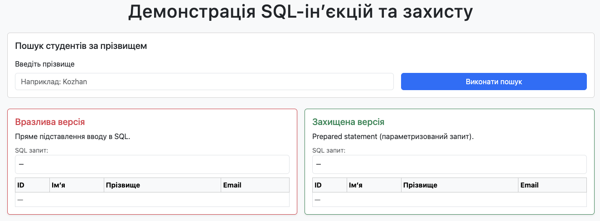
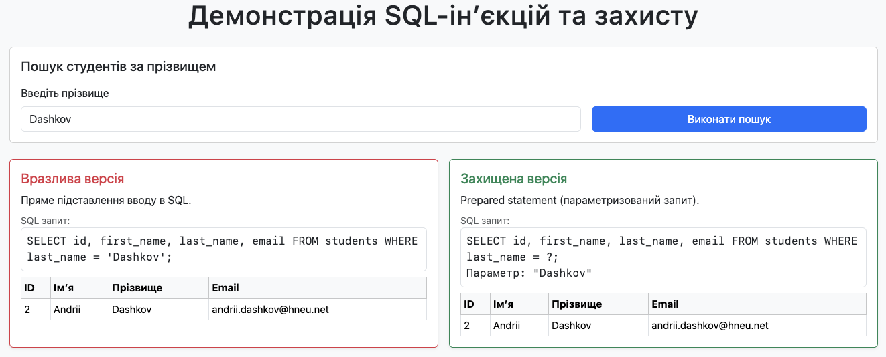
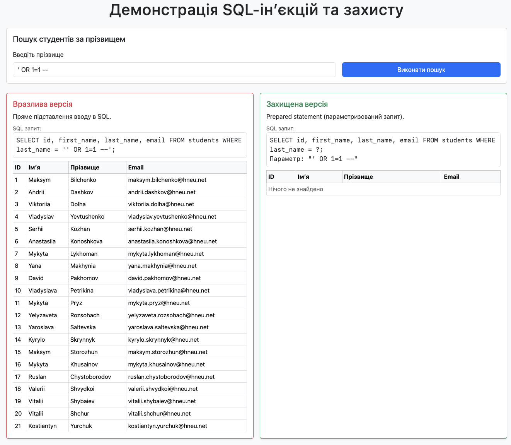

# Лабораторна робота № 6. Етичний хакінг власного застосунку

Для того, щоб запустити програму на виконання, достатньо відкрити файл **index.html** в будь-якому браузері. Програма використовує SQLite для браузера через WebAssembly. Програма представляє пошук інформації про студента в базі даних студентів за прізвищем.

## Приклади роботи програми

Програма має наступний початковий вигляд:

Програма містить поле для введення прізвище студента для пошуку інформації. Також внизу ліворуч програма демонструє варіант вразливого SQL-коду, використаного для введеного пошукового запиту. Внизу праворуч програма виводить варіант захищеного SQL-коду, використаного для введеного пошукового запиту.

У полі пошуку необхідно ввести прізвище студента, інформацію про якого ми хочемо переглянути. До прикладу, вводимо прізвище _Dashkov_ і переглядаємо отриману інформацію.

Внизу ліворуч та праворуч бачимо SQL-код, який був використаний для введеного пошукового запиту, а також результати виконання цього SQL-коду.

Якщо ж зараз ми спробуємо виконати SQL-інʼєкцію, то наочно побачимо як себе поводять вразливий та захищений SQL-код.

Як бачимо, вразливий SQL-код прочитав запит &laquo;як є&raquo; і повернув дані всіх рядків таблиці. Натомість захищений код не зрозумів запит і нічого не повернув.