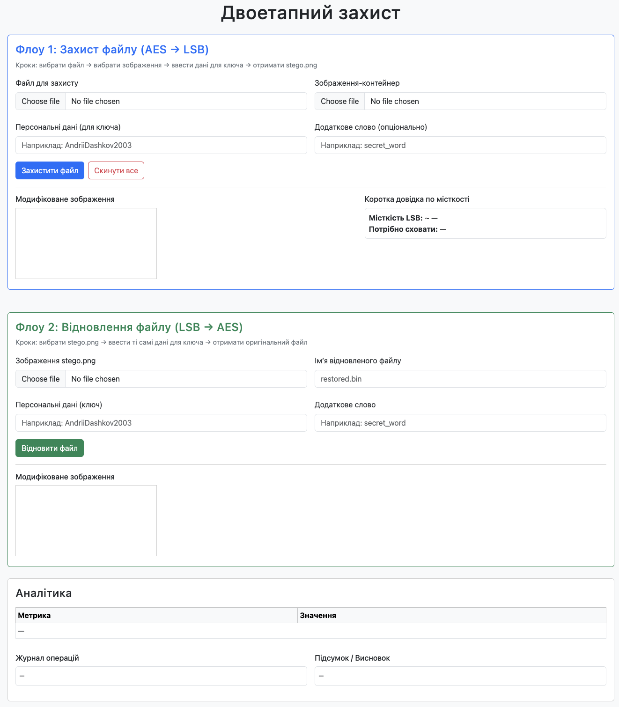
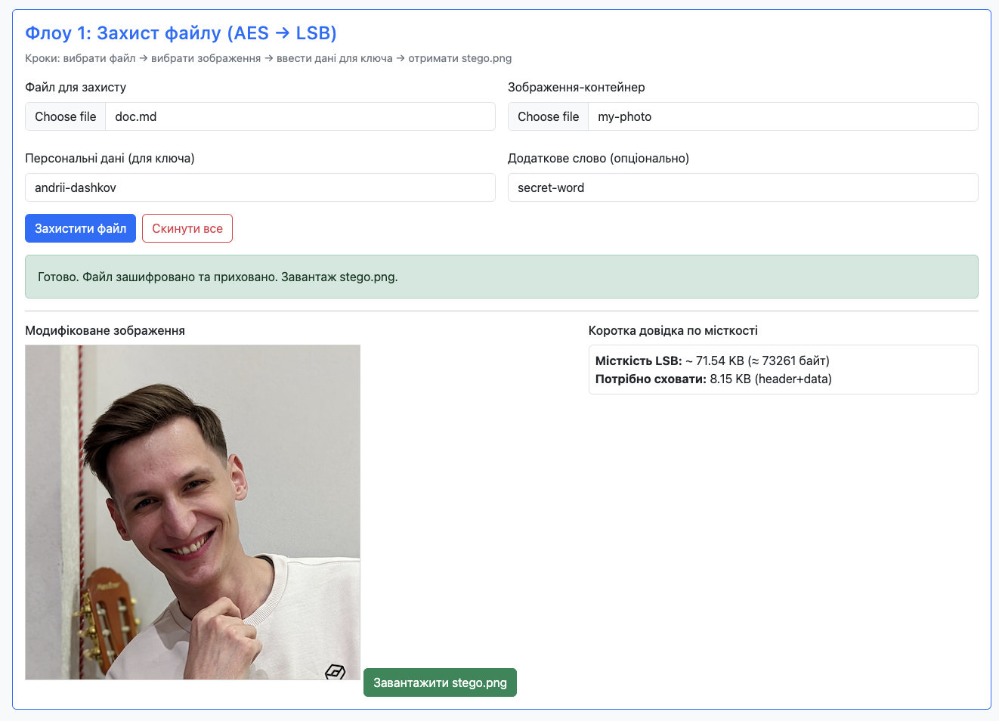
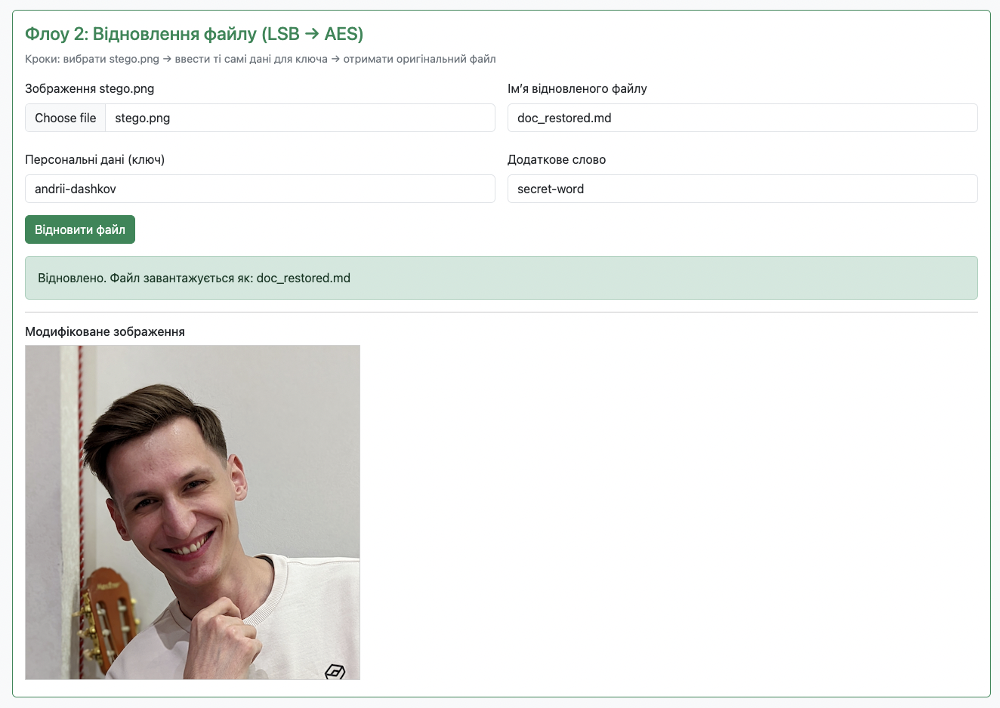
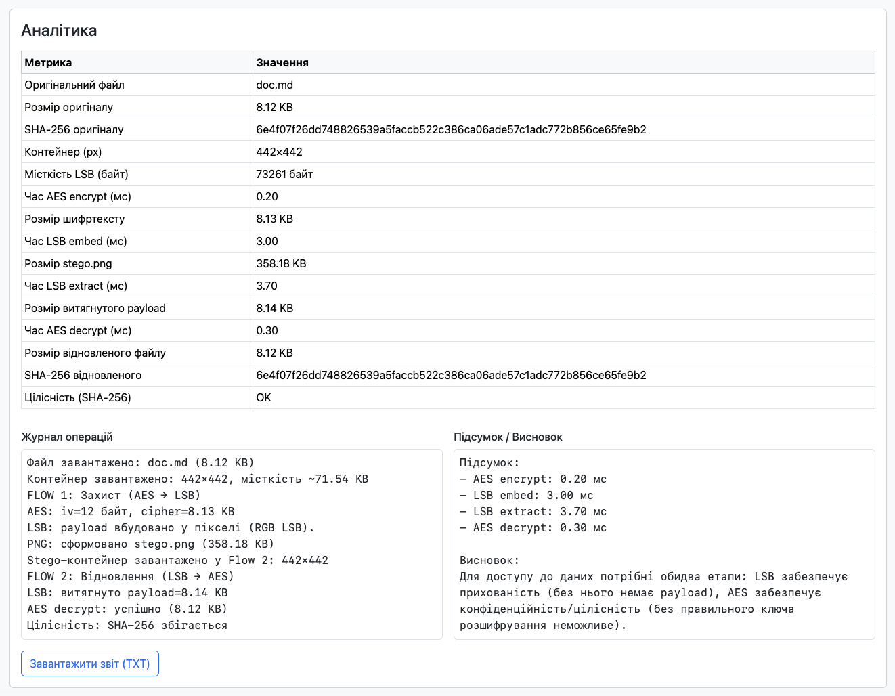

# Лабораторна робота № 7. Комплексний захист особистого проекту

Для того, щоб запустити програму на виконання, достатньо відкрити файл **index.html** в будь-якому браузері.

## Приклади роботи програми

Програма має наступний початковий вигляд:

У першому блоці програма реалізує логіку двоетапного захисту файлу. Тут необхідно обрати файл, який ми хочемо захистити, та зображення, в якому ми приховаємо зашифрований файл, а також потрібно ввести персональні дані та (опціонально) додаткове слово для створення ключа шифрування файлу. Після введення всіх даних натискаємо на кнопку "Захистити файл", після чого зʼявиться кнопка скачування зображення з прихованим зашифрованим файлом - "Завантажити stego.png" - натискаємо на неї.

У другому блоці програма реалізує логіку відновлення файлу. В цьому розділі необхідно обрати зображення з прихованим в ньому зашифрованим файлом, опціонально вказати імʼя, під яким збережеться відновлений файл, а також потрібно ввести ті самі персональні дані та додаткове слово, які були використані на першому етапі. Після введення всіх даних натискаємо на кнопку "Відновити файл", після чого, у разі успішної екстракції зі зображення та розшифрування, на компʼютер автоматично скачується відновлений файл.

Також програма провела аналітику, в якій ми можемо порівняти SHA-256 хеш оригінального та відновленого файлів, побачити розміри файлів та зашифрованих даних, а також час обробки даних.

Крім цього, ми також можемо натиснути на кнопку "Завантажити звіт (TXT)" і програма створить TXT файл з виписаними в нього усіма аналітичними даними.